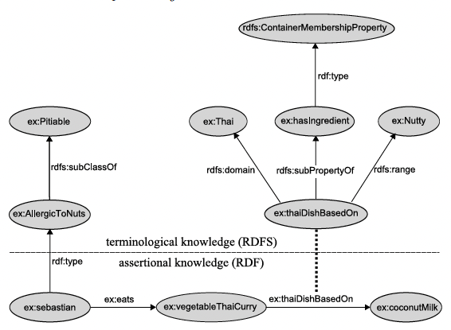
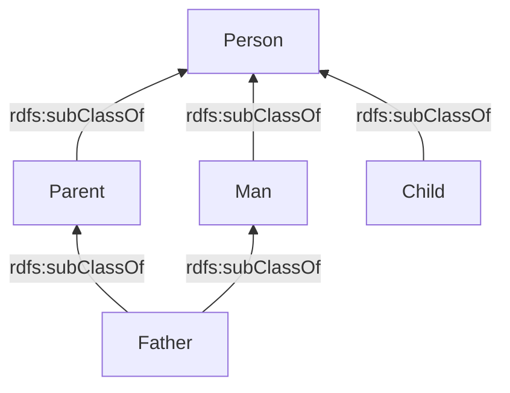
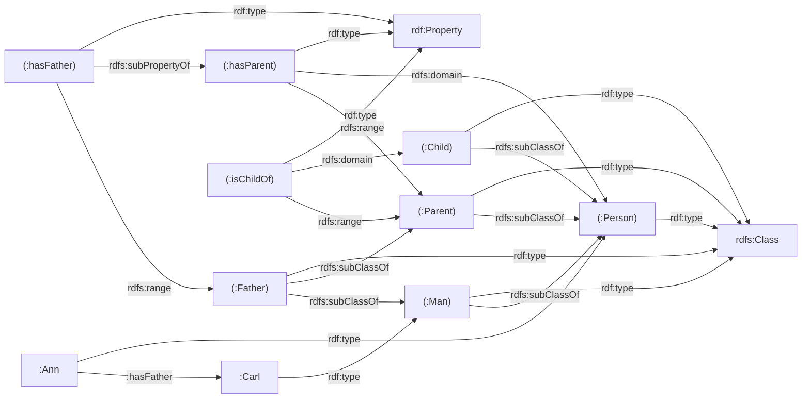

# Part 2: RDFS — Solutions (Exercises 1–2)

---

## Exercise 1 — Describe the Ontology

**Original ontology diagram:**



### Natural Language Description

This ontology models a food/allergy domain with two layers:

**Terminological Knowledge (RDFS — Schema level):**
- `ex:AllergicToNuts` is a class; `ex:Pitiable` is its **superclass** (`rdfs:subClassOf`).
- `ex:Thai` is a class representing Thai cuisine.
- `ex:Nutty` is a class representing nutty foods.
- `ex:hasIngredient` is a property — it is of type `rdfs:ContainerMembershipProperty`.
- `ex:thaiDishBasedOn` is a **subproperty** of `ex:hasIngredient` (`rdfs:subPropertyOf`).
- `ex:thaiDishBasedOn` has **domain** `ex:Thai` and **range** `ex:Nutty`.

**Assertional Knowledge (RDF — Instance level):**
- `ex:sebastian` is an instance of `ex:AllergicToNuts`.
- `ex:sebastian` `ex:eats` `ex:vegetableThaiCurry`.
- `ex:vegetableThaiCurry` `ex:thaiDishBasedOn` `ex:coconutMilk`.

### Turtle Representation

```turtle
@prefix rdf:  <http://www.w3.org/1999/02/22-rdf-syntax-ns#> .
@prefix rdfs: <http://www.w3.org/2000/01/rdf-schema#> .
@prefix ex:   <http://example.org/> .

### ── Terminological Knowledge (RDFS) ──

ex:Pitiable        rdf:type   rdfs:Class .
ex:AllergicToNuts   rdf:type   rdfs:Class ;
                    rdfs:subClassOf  ex:Pitiable .
ex:Thai            rdf:type   rdfs:Class .
ex:Nutty           rdf:type   rdfs:Class .

ex:hasIngredient   rdf:type   rdfs:ContainerMembershipProperty .

ex:thaiDishBasedOn rdf:type   rdf:Property ;
                   rdfs:subPropertyOf  ex:hasIngredient ;
                   rdfs:domain   ex:Thai ;
                   rdfs:range    ex:Nutty .

### ── Assertional Knowledge (RDF) ──

ex:sebastian          rdf:type   ex:AllergicToNuts .
ex:sebastian          ex:eats    ex:vegetableThaiCurry .
ex:vegetableThaiCurry ex:thaiDishBasedOn  ex:coconutMilk .
```

> [!NOTE]
> **Inferences from RDFS reasoning:**
> - `ex:sebastian` is also an instance of `ex:Pitiable` (via `subClassOf` transitivity).
> - `ex:vegetableThaiCurry` is inferred to be of type `ex:Thai` (via `rdfs:domain` of `thaiDishBasedOn`).
> - `ex:coconutMilk` is inferred to be of type `ex:Nutty` (via `rdfs:range` of `thaiDishBasedOn`).
> - `ex:vegetableThaiCurry ex:hasIngredient ex:coconutMilk` is inferred (via `subPropertyOf`).

---

## Exercise 2 — True/False Analysis

### Given RDF Definitions (recap)

```turtle
@prefix rdf:  <http://www.w3.org/1999/02/22-rdf-syntax-ns#> .
@prefix rdfs: <http://www.w3.org/2000/01/rdf-schema#> .
@prefix :     <http://example.com/terms#> .

:Person     a rdfs:Class .
:Man        a rdfs:Class ; rdfs:subClassOf :Person .
:Parent     a rdfs:Class ; rdfs:subClassOf :Person .
:Father     a rdfs:Class ; rdfs:subClassOf :Parent ; rdfs:subClassOf :Man .
:Child      a rdfs:Class ; rdfs:subClassOf :Person .

:hasParent  a rdf:Property ; rdfs:domain :Person ; rdfs:range :Parent .
:hasFather  a rdf:Property ; rdfs:subPropertyOf :hasParent ; rdfs:range :Father .
:isChildOf  a rdf:Property ; rdfs:domain :Child ; rdfs:range :Parent .

:Ann   a :Person ; :hasFather :Carl .
:Carl  a :Man .
```

### Class Hierarchy Diagram



### Part A — Graph



### Part B — True/False Statements

| # | Statement | Answer | Explanation |
|---|-----------|--------|-------------|
| 1 | `:Father rdfs:subClassOf :Person` | **TRUE** | `:Father` ⊆ `:Parent` ⊆ `:Person` by **transitivity of `rdfs:subClassOf`** (rdfs11). |
| 2 | `:Man rdfs:subClassOf :Person` | **TRUE** | Explicitly stated in the data. |
| 3 | `:Carl a :Person` | **TRUE** | `:Carl a :Man`, and `:Man rdfs:subClassOf :Person` → by **rdfs9** (instance + subclass → instance of superclass), `:Carl a :Person`. |
| 4 | `:Carl a :Parent` | **TRUE** | `:Ann :hasFather :Carl`. `:hasFather rdfs:subPropertyOf :hasParent` → by **rdfs7**, `:Ann :hasParent :Carl`. `:hasParent rdfs:range :Parent` → by **rdfs3** (range rule), `:Carl a :Parent`. |
| 5 | `:Carl :hasChild :Ann` | **FALSE** | There is no `:hasChild` property defined in the ontology, and no `owl:inverseOf` declaration (RDFS alone cannot infer inverses). This triple cannot be entailed. |
| 6 | `:Carl a :Man` | **TRUE** | Explicitly asserted: `:Carl a :Man`. |
| 7 | `:Carl a :Father` | **TRUE** | From statement 4, `:Carl a :Parent`. From the assertion, `:Carl a :Man`. Additionally, `:Ann :hasFather :Carl`, and `:hasFather rdfs:range :Father` → by **rdfs3**, `:Carl a :Father`. |
| 8 | `:Child rdf:type rdfs:Resource` | **TRUE** | In RDFS, **everything is an `rdfs:Resource`**. Every described resource is an instance of `rdfs:Resource` (axiomatic triple). |
| 9 | `:Ann a :Child` | **FALSE** | There is no assertion or RDFS rule that makes `:Ann` an instance of `:Child`. She is `:Person` (via `hasFather` domain inference), but `:Child` is not the same as `:Person` — it's just a subclass. Being a `:Person` does NOT make you a `:Child`. |
| 10 | `:Ann :isChildOf :Carl` | **FALSE** | `:isChildOf` is a completely independent property. It is NOT declared as related to `:hasParent` or `:hasFather` (no `rdfs:subPropertyOf`, no inverse). RDFS cannot infer this. |
| 11 | `:Ann :hasParent :Carl` | **TRUE** | `:Ann :hasFather :Carl` + `:hasFather rdfs:subPropertyOf :hasParent` → by **rdfs7**, `:Ann :hasParent :Carl`. |
| 12 | `:Ann :hasParent _:x` | **TRUE** | Since `:Ann :hasParent :Carl` is entailed (from #11), there trivially exists some resource (namely `:Carl`) such that `:Ann :hasParent` that resource. In RDF semantics, existential statements with blank nodes are entailed when a concrete instance exists. |
| 13 | `:Ann :hasParent [ rdf:type :Person ]` | **TRUE** | From #11: `:Ann :hasParent :Carl`. From #3: `:Carl a :Person`. So `:Ann :hasParent` someone who is a `:Person`. The blank node pattern `[ rdf:type :Person ]` is satisfied by `:Carl`. |
| 14 | `:hasFather rdfs:domain :Person` | **TRUE** | `:hasFather rdfs:subPropertyOf :hasParent` and `:hasParent rdfs:domain :Person`. By **rdfs-entailment** (combining rdfs7 and rdfs2): if `p rdfs:subPropertyOf q` and `q rdfs:domain C`, then `p rdfs:domain C`. So `:hasFather rdfs:domain :Person`. |
| 15 | `rdfs:range rdf:type rdfs:Resource` | **TRUE** | Same as #8 — in RDFS, every resource (including `rdfs:range` itself) is an `rdfs:Resource`. This is axiomatic. |
| 16 | `:hasFather rdfs:range :Father` | **TRUE** | Explicitly stated in the given RDF data. |
| 17 | `:hasFather rdfs:domain [ rdfs:subClassOf :Person ]` | **TRUE** | From #14, `:hasFather rdfs:domain :Person`. And `:Person rdfs:subClassOf :Person` is always true (reflexivity of `rdfs:subClassOf` — axiomatic in RDFS, rule rdfs10). So the blank node `[ rdfs:subClassOf :Person ]` can be matched to `:Person`. |
| 18 | `:Father rdfs:subClassOf [ rdfs:subClassOf :Person ]` | **TRUE** | From #1: `:Father rdfs:subClassOf :Person`. By reflexivity (rdfs10): `:Person rdfs:subClassOf :Person`. So the blank node `[ rdfs:subClassOf :Person ]` can be matched to `:Person`, and `:Father rdfs:subClassOf :Person` holds. |

> [!IMPORTANT]
> **Key RDFS Entailment Rules Used:**
> - **rdfs2** (domain): `?p rdfs:domain ?C` ∧ `?x ?p ?y` → `?x rdf:type ?C`
> - **rdfs3** (range): `?p rdfs:range ?C` ∧ `?x ?p ?y` → `?y rdf:type ?C`
> - **rdfs7** (subPropertyOf): `?p rdfs:subPropertyOf ?q` ∧ `?x ?p ?y` → `?x ?q ?y`
> - **rdfs9** (subClassOf + type): `?C rdfs:subClassOf ?D` ∧ `?x rdf:type ?C` → `?x rdf:type ?D`
> - **rdfs10** (reflexivity): `?C rdfs:subClassOf ?C`
> - **rdfs11** (transitivity): `?A rdfs:subClassOf ?B` ∧ `?B rdfs:subClassOf ?C` → `?A rdfs:subClassOf ?C`
