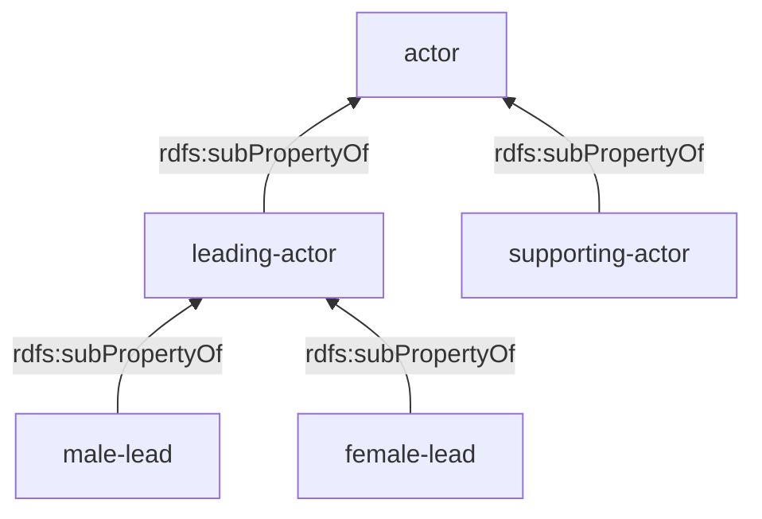

# Part 3: OWL — Solutions (Exercises 1–4)

---

## Exercise 1 — Pizza Ontology (Manchester)

### Q1. Open pizza.owl, examine classes and properties.

The Pizza ontology defines a hierarchy rooted at `owl:Thing` with main classes:
- **Pizza** — a food base with toppings
- **PizzaBase** — ThinAndCrispy or DeepPan
- **PizzaTopping** — CheeseTopping, MeatTopping, VegetableTopping, FishTopping, etc.
- **NamedPizza** — subclass of Pizza, with named instances (Margherita, American, etc.)
- **Country** — instances like Italy, England, France, Germany, America

### Q2. Margherita and VegetarianPizza

**Margherita** is defined as:
```
Pizza
  and (hasTopping some MozzarellaTopping)
  and (hasTopping some TomatoTopping)
  and (hasTopping only (MozzarellaTopping or TomatoTopping))
```

**VegetarianPizza** is defined as:
```
Pizza
  and (hasTopping only
       (CheeseTopping or FruitTopping or HerbSpiceTopping
        or NutTopping or SauceTopping or VegetableTopping))
```

**Is Margherita a VegetarianPizza?**  
**Yes** — after classification by a reasoner. Margherita has only MozzarellaTopping and TomatoTopping. MozzarellaTopping ⊆ CheeseTopping and TomatoTopping ⊆ VegetableTopping, both of which are in the allowed set for VegetarianPizza. The `hasTopping only (...)` closure axiom on Margherita ensures no other toppings exist.

### Q3. hasIngredient

| Aspect | Value |
|--------|-------|
| **Domain** | `Food` |
| **Range** | `Food` |
| **Subproperties** | `hasBase`, `hasTopping` |
| **Inverse** | `isIngredientOf` |
| **Characteristics** | **Transitive** |

### Q4. Classifying — owl:Nothing subclasses

**Asserted vs. Inferred class hierarchy:**
- The **asserted** hierarchy contains only what was explicitly stated by the ontology author.
- The **inferred** hierarchy is computed by a DL reasoner (e.g., Pellet, HermiT) using logical entailment from all axioms (including restrictions, disjointness, domain/range).

**What does it mean to be a subclass of `owl:Nothing`?**  
`owl:Nothing` is the **empty class** — it has no instances. A class that is a subclass of `owl:Nothing` is **unsatisfiable** (logically inconsistent). It means the class restrictions are contradictory and no individual can ever belong to it.

**Why do two classes appear as subclasses of `owl:Nothing`?**  
Typically `IceCreamCourse` and `CheeseyVegetableTopping` (depending on the version). These classes have contradictory restrictions. For example:
- A class might require `hasTopping some X` AND `hasTopping only Y`, where X ⊄ Y.
- Or a class inherits disjoint parent constraints that cannot be simultaneously satisfied.

**Margherita inferred superclasses:**
After classification, Margherita is inferred to be a subclass of: `VegetarianPizza`, `CheeseyPizza`, `Pizza`, `Food`, `DomainConcept`, `owl:Thing`.

### Q5. Grandiosa (new NamedPizza)

Grandiosa is defined as:
```
NamedPizza
  and (hasTopping some HamTopping)
  and (hasTopping some TomatoTopping)
  and (hasTopping some CheeseTopping)
```

**Inferred superclasses after classification:**
- `MeatyPizza` — because it has HamTopping (⊆ MeatTopping)
- `CheeseyPizza` — because it has CheeseTopping
- `Pizza`, `Food`, `DomainConcept`, `owl:Thing`
- It is **NOT** a `VegetarianPizza` (it has meat), but NOTE: without a **closure axiom** (`hasTopping only (...)`), the reasoner may not be able to classify it precisely. It remains **non-vegetarian** because HamTopping ⊆ MeatTopping, and MeatTopping is disjoint with the allowed toppings for VegetarianPizza.

### Q6. Grandiosa from Norway

```turtle
:Grandiosa :hasCountryOfOrigin :Norway .
:Norway    owl:differentFrom :Italy, :America, :England,
                             :France, :Germany .
```

After reasoning: Grandiosa now has a country of origin. If a class like `AmericanPizza` requires `hasCountryOfOrigin value America`, Grandiosa cannot be American since `:Norway owl:differentFrom :America`.

---

## Exercise 2 — Medicinal Products Ontology

**Reference diagram:**


```turtle
@prefix rdf:  <http://www.w3.org/1999/02/22-rdf-syntax-ns#> .
@prefix rdfs: <http://www.w3.org/2000/01/rdf-schema#> .
@prefix owl:  <http://www.w3.org/2002/07/owl#> .
@prefix xsd:  <http://www.w3.org/2001/XMLSchema#> .
@prefix :     <http://example.org/pharma#> .

### ── Ontology Declaration ──
<http://example.org/pharma> rdf:type owl:Ontology .

### ── Classes ──
:MedicinalProduct  rdf:type  owl:Class .

:OverTheCounterDrug  rdf:type  owl:Class ;
    rdfs:subClassOf  :MedicinalProduct .

:PrescriptionBasedDrug  rdf:type  owl:Class ;
    rdfs:subClassOf  :MedicinalProduct .

:ActiveSubstance  rdf:type  owl:Class .

### Disjointness: OTC and Prescription drugs are disjoint
:OverTheCounterDrug  owl:disjointWith  :PrescriptionBasedDrug .

### Union: Medicinal products are either OTC or Prescription
:MedicinalProduct  owl:equivalentClass  [
    rdf:type  owl:Class ;
    owl:unionOf ( :OverTheCounterDrug :PrescriptionBasedDrug )
] .

### ── Properties ──

# Each drug consists of an active substance
:includes  rdf:type  owl:ObjectProperty ;
    rdfs:domain  :MedicinalProduct ;
    rdfs:range   :ActiveSubstance .

# Each drug consists of an active substance (existential restriction)
:MedicinalProduct  rdfs:subClassOf  [
    rdf:type  owl:Restriction ;
    owl:onProperty  :includes ;
    owl:someValuesFrom  :ActiveSubstance
] .

# Each drug can be replaced by zero or more other drugs
:isSubstitutable  rdf:type  owl:ObjectProperty ;
    rdfs:domain  :MedicinalProduct ;
    rdfs:range   :MedicinalProduct .

### ── Instances ──
:Panadol     rdf:type  :OverTheCounterDrug .
:Tramadol    rdf:type  :PrescriptionBasedDrug .
:Loperamide  rdf:type  :ActiveSubstance .
```

**Manchester Syntax summary:**
```
Class: MedicinalProduct
    EquivalentTo: OverTheCounterDrug or PrescriptionBasedDrug
    SubClassOf: includes some ActiveSubstance

Class: OverTheCounterDrug
    SubClassOf: MedicinalProduct
    DisjointWith: PrescriptionBasedDrug

Class: PrescriptionBasedDrug
    SubClassOf: MedicinalProduct

ObjectProperty: includes
    Domain: MedicinalProduct
    Range: ActiveSubstance

ObjectProperty: isSubstitutable
    Domain: MedicinalProduct
    Range: MedicinalProduct

Individual: Panadol    Types: OverTheCounterDrug
Individual: Tramadol   Types: PrescriptionBasedDrug
Individual: Loperamide Types: ActiveSubstance
```

---

## Exercise 3 — Courses & Teachers Ontology

**Reference diagram:**


```turtle
@prefix rdf:  <http://www.w3.org/1999/02/22-rdf-syntax-ns#> .
@prefix rdfs: <http://www.w3.org/2000/01/rdf-schema#> .
@prefix owl:  <http://www.w3.org/2002/07/owl#> .
@prefix :     <http://example.org/education#> .

### ── Ontology ──
<http://example.org/education> rdf:type owl:Ontology .

### ── Classes ──
:Course  rdf:type  owl:Class .

:LaboratoryCourse  rdf:type  owl:Class ;
    rdfs:subClassOf  :Course .

:Teacher  rdf:type  owl:Class .

:Professor  rdf:type  owl:Class ;
    rdfs:subClassOf  :Teacher .

:Assistant  rdf:type  owl:Class ;
    rdfs:subClassOf  :Teacher .

:Homework  rdf:type  owl:Class .

### Disjointness
:Professor  owl:disjointWith  :Assistant .

### Union: Teacher = Professor or Assistant
:Teacher  owl:equivalentClass  [
    rdf:type  owl:Class ;
    owl:unionOf ( :Professor :Assistant )
] .

### ── Properties ──

# Courses are organized by teachers
:organize  rdf:type  owl:ObjectProperty ;
    rdfs:domain  :Teacher ;
    rdfs:range   :Course .

# Professor teaches courses (any course)
:teach  rdf:type  owl:ObjectProperty ;
    rdfs:domain  :Professor ;
    rdfs:range   :Course .

# Assistant only teaches laboratory/practical courses
# (restrict the range for assistants)
:Assistant  rdfs:subClassOf  [
    rdf:type  owl:Restriction ;
    owl:onProperty  :teach ;
    owl:allValuesFrom  :LaboratoryCourse
] .

# Homework is part of the course
:isPartOf  rdf:type  owl:ObjectProperty ;
    rdfs:domain  :Homework ;
    rdfs:range   :Course .
```

**Manchester Syntax summary:**
```
Class: Course
Class: LaboratoryCourse  SubClassOf: Course
Class: Teacher  EquivalentTo: Professor or Assistant
Class: Professor  SubClassOf: Teacher, DisjointWith: Assistant
Class: Assistant  SubClassOf: Teacher, teach only LaboratoryCourse
Class: Homework

ObjectProperty: organize  Domain: Teacher  Range: Course
ObjectProperty: teach     Domain: Professor  Range: Course
ObjectProperty: isPartOf  Domain: Homework  Range: Course
```

---

## Exercise 4 — Film Ontology

```turtle
@prefix rdf:  <http://www.w3.org/1999/02/22-rdf-syntax-ns#> .
@prefix rdfs: <http://www.w3.org/2000/01/rdf-schema#> .
@prefix owl:  <http://www.w3.org/2002/07/owl#> .
@prefix dc:   <http://purl.org/dc/elements/1.1/> .
@prefix foaf: <http://xmlns.com/foaf/0.1/> .
@prefix :     <http://example.org/film#> .
@prefix people: <http://example.org/people/> .
@prefix film:   <http://example.org/films/> .

### ── Ontology ──
<http://example.org/film> rdf:type owl:Ontology .

### ══════════════════════════════════════
###  CLASSES
### ══════════════════════════════════════

:Person  rdf:type  owl:Class .
:Man     rdf:type  owl:Class ; rdfs:subClassOf :Person .
:Woman   rdf:type  owl:Class ; rdfs:subClassOf :Person .

### Person = Man ⊔ Woman (covering axiom)
:Person  owl:equivalentClass  [
    rdf:type owl:Class ;
    owl:unionOf ( :Man :Woman )
] .

### Man and Woman are disjoint (cannot be both)
:Man  owl:disjointWith  :Woman .

:Movie              rdf:type  owl:Class .
:LoveMovie          rdf:type  owl:Class ; rdfs:subClassOf :Movie .
:AnimalDocumentary   rdf:type  owl:Class ; rdfs:subClassOf :Movie .
:AnimatedMovie       rdf:type  owl:Class ; rdfs:subClassOf :Movie .

### ══════════════════════════════════════
###  PROPERTIES
### ══════════════════════════════════════

:director  rdf:type  owl:ObjectProperty ;
    rdfs:domain  :Movie ;
    rdfs:range   :Person .

### actor is the super-property
:actor  rdf:type  owl:ObjectProperty ;
    rdfs:domain  :Movie ;
    rdfs:range   :Person .

### leading-actor ⊆ actor
:leading-actor  rdf:type  owl:ObjectProperty ;
    rdfs:subPropertyOf  :actor ;
    rdfs:domain  :Movie ;
    rdfs:range   :Person .

### supporting-actor ⊆ actor
:supporting-actor  rdf:type  owl:ObjectProperty ;
    rdfs:subPropertyOf  :actor ;
    rdfs:domain  :Movie ;
    rdfs:range   :Person .

### male-lead ⊆ leading-actor, range Man
:male-lead  rdf:type  owl:ObjectProperty ;
    rdfs:subPropertyOf  :leading-actor ;
    rdfs:domain  :Movie ;
    rdfs:range   :Man .

### female-lead ⊆ leading-actor, range Woman
:female-lead  rdf:type  owl:ObjectProperty ;
    rdfs:subPropertyOf  :leading-actor ;
    rdfs:domain  :Movie ;
    rdfs:range   :Woman .

dc:title  rdf:type  owl:DatatypeProperty .

### ══════════════════════════════════════
###  COMPLEX CLASS DEFINITIONS
### ══════════════════════════════════════

### LoveMovie: has at least 1 male-lead AND at least 1 female-lead
:LoveMovie  owl:equivalentClass  [
    rdf:type  owl:Class ;
    owl:intersectionOf (
        :Movie
        [   rdf:type  owl:Restriction ;
            owl:onProperty  :male-lead ;
            owl:someValuesFrom  :Man ]
        [   rdf:type  owl:Restriction ;
            owl:onProperty  :female-lead ;
            owl:someValuesFrom  :Woman ]
    )
] .

### Film without actor = AnimalDocumentary ⊔ AnimatedMovie
### (Movie ⊓ ¬(∃actor.Person)) ⊆ (AnimalDocumentary ⊔ AnimatedMovie)
[   rdf:type  owl:Class ;
    owl:intersectionOf (
        :Movie
        [   rdf:type  owl:Class ;
            owl:complementOf [
                rdf:type  owl:Restriction ;
                owl:onProperty  :actor ;
                owl:someValuesFrom  owl:Thing
            ]
        ]
    )
] rdfs:subClassOf [
    rdf:type  owl:Class ;
    owl:unionOf ( :AnimalDocumentary :AnimatedMovie )
] .

### ══════════════════════════════════════
###  INSTANCES (given in the exercise)
### ══════════════════════════════════════

film:avatar  rdf:type  :Movie ;
    dc:title  "Avatar"@en ;
    :director  people:james ;
    :leading-actor  people:sam ;
    :leading-actor  people:zoe ;
    :supporting-actor  people:michelle .

people:james    rdf:type :Man ;  foaf:name "James Cameron" .
people:sam      rdf:type :Man ;  foaf:name "Sam Worthington" .
people:zoe      rdf:type :Woman ; foaf:name "Zoe Saldana" .
people:michelle rdf:type :Woman ; foaf:name "Michelle Rodriguez" .
```

**Manchester Syntax summary:**
```
Class: Person  EquivalentTo: Man or Woman
Class: Man     SubClassOf: Person, DisjointWith: Woman
Class: Woman   SubClassOf: Person

Class: Movie
Class: LoveMovie
    EquivalentTo: Movie
        and (male-lead some Man)
        and (female-lead some Woman)
Class: AnimalDocumentary  SubClassOf: Movie
Class: AnimatedMovie      SubClassOf: Movie

ObjectProperty: actor           Domain: Movie  Range: Person
ObjectProperty: leading-actor   SubPropertyOf: actor
ObjectProperty: supporting-actor SubPropertyOf: actor
ObjectProperty: male-lead       SubPropertyOf: leading-actor  Range: Man
ObjectProperty: female-lead     SubPropertyOf: leading-actor  Range: Woman

# Film without an actor → AnimalDocumentary or AnimatedMovie
Class: (Movie and not (actor some Thing))
    SubClassOf: AnimalDocumentary or AnimatedMovie
```

### Property Hierarchy Diagram


