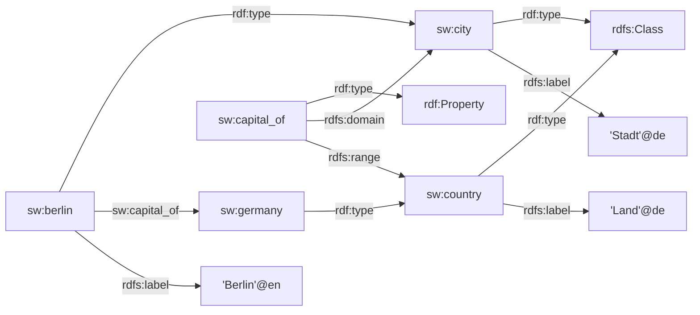
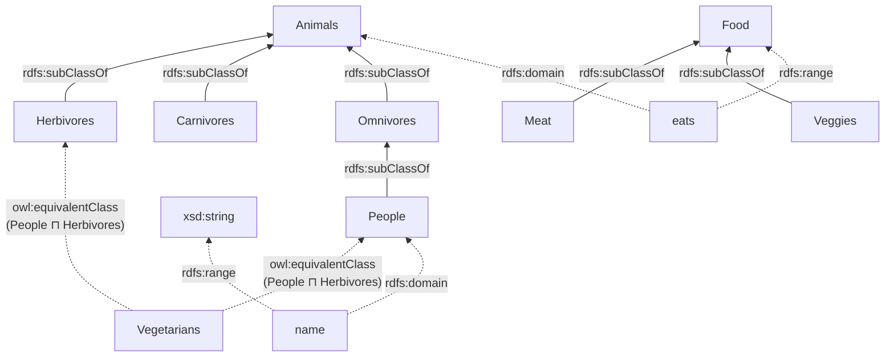

# Lời Giải — Bài Kiểm Tra Web Ngữ Nghĩa (90 phút)

---

## Bài 1. RDF (2 điểm)

### 1) Có bao nhiêu bộ ba (triples)? Liệt kê.

**Tổng cộng: 14 triples**

| # | Subject | Predicate | Object |
|---|---------|-----------|--------|
| 1 | `_:b1` | `rdf:type` | `foaf:Person` |
| 2 | `_:b1` | `foaf:firstName` | `"Peter"` |
| 3 | `_:b1` | `ex:age` | `"65"^^xsd:integer` |
| 4 | `_:b1` | `ex:country` | `ex:us` |
| 5 | `ex:minh` | `rdf:type` | `foaf:Person` |
| 6 | `ex:minh` | `foaf:firstName` | `"Minh"@en` |
| 7 | `ex:minh` | `ex:age` | `"67"^^xsd:integer` |
| 8 | `ex:minh` | `ex:country` | `_:b2` |
| 9 | `_:b2` | `rdf:type` | `ex:Country` |
| 10 | `_:b2` | `ex:name` | `"Vietnam"@en` |
| 11 | `_:b2` | `ex:name` | `"Việt Nam"@vi` |
| 12 | `ex:us` | `rdf:type` | `ex:Country` |
| 13 | `ex:us` | `ex:name` | `"Mỹ"@vi` |
| 14 | `ex:us` | `ex:name` | `"United States of America"@en` |

> [!NOTE]
> Cú pháp `[ ]` tạo blank node `_:b2`. Dấu `;` nối nhiều predicate cùng subject. Dấu `,` nối nhiều object cùng predicate.

### 2) Bao nhiêu triples có subject là blank node?

**7 triples** (subject `_:b1` hoặc `_:b2`): Triples #1–#4 (subject `_:b1`) và #9–#11 (subject `_:b2`).

### 3) Bao nhiêu triples có object là URI?

**5 triples:**

| # | Triple |
|---|--------|
| 1 | `_:b1 rdf:type foaf:Person` |
| 2 | `_:b1 ex:country ex:us` |
| 3 | `ex:minh rdf:type foaf:Person` |
| 4 | `_:b2 rdf:type ex:Country` |
| 5 | `ex:us rdf:type ex:Country` |

> [!NOTE]
> `_:b2` (triple #8) là blank node, KHÔNG phải URI → không tính.

### 4) Có bao nhiêu predicate khác nhau?

**5 predicates:** `rdf:type`, `foaf:firstName`, `ex:age`, `ex:country`, `ex:name`

---

## Bài 2. RDF (2 điểm)

### 1) Liệt kê classes, properties, instances

**Classes** (có `rdf:type rdfs:Class`):
- `sw:country`
- `sw:city`

**Properties** (có `rdf:type rdf:Property`):
- `sw:capital_of` (domain: `sw:city`, range: `sw:country`)

**Instances:**
- `sw:germany` — instance của `sw:country`
- `sw:berlin` — instance của `sw:city`

### 2) Đồ thị biểu diễn



---

## Bài 3. RDFS và SPARQL (4 điểm)

### Phân tích lược đồ từ đồ thị

**Classes:** `Person`, `Parent`, `Woman`, `Child`, `Mother`

**SubClassOf:**
- `Parent rdfs:subClassOf Person`
- `Woman rdfs:subClassOf Person`
- `Child rdfs:subClassOf Person`
- `Mother rdfs:subClassOf Parent`
- `Mother rdfs:subClassOf Woman`

**SubPropertyOf:**
- `hasMother rdfs:subPropertyOf hasParent`

**Domain/Range:**
- `hasParent`: domain `Child`, range `Person`
- `hasMother`: domain `Child`, range `Mother`
- `isChildOf`: domain `Child`, range `Parent`

**Instances & triples từ đồ thị:**
- `Hoa hasMother Hong`, `Manh hasMother Hong`, `Hong hasMother Ban`
- `Hoa hasSister Minh`, `Manh hasSister Minh` (hoặc tương tự)

### a) Các phát biểu có suy diễn được không?

#### 1. `:Hoa :hasParent [ a :Person ]` → **ĐÚNG ✅**

- `Hoa hasMother Hong` (từ đồ thị)
- `hasMother rdfs:subPropertyOf hasParent` → **rdfs7**: `Hoa hasParent Hong`
- `hasParent rdfs:range Person` → **rdfs3**: `Hong rdf:type Person`
- Vậy `Hoa hasParent Hong` với `Hong a Person` → viết tắt: `Hoa hasParent [a Person]` ✅

#### 2. `:Hong a :Mother` → **ĐÚNG ✅**

- `Hoa hasMother Hong` (từ đồ thị)
- `hasMother rdfs:range Mother` → **rdfs3**: `Hong rdf:type Mother` ✅

#### 3. `:Hoa :isChildOf :Hong` → **SAI ❌**

- Ta có `Hoa hasParent Hong` (suy ra qua rdfs7)
- Nhưng `isChildOf` là property **riêng biệt**, KHÔNG phải inverse của `hasParent`
- RDFS **không hỗ trợ suy diễn inverse**. Cần OWL (`owl:inverseOf`)
- → Không suy diễn được ❌

#### 4. `:Hoa :hasParent :Ban` → **SAI ❌**

- `Hoa hasParent Hong` và `Hong hasParent Ban` (qua rdfs7)
- Nhưng `hasParent` **KHÔNG bắc cầu** (transitive) trong RDFS
- RDFS chỉ có tính bắc cầu cho `rdfs:subClassOf` và `rdfs:subPropertyOf`
- → Không suy diễn được ❌

### b) Truy vấn SPARQL

```
PREFIX fam: <http://example.org/family#>
PREFIX rdf: <http://www.w3.org/1999/02/22-rdf-syntax-ns#>
PREFIX rdfs: <http://www.w3.org/2000/01/rdf-schema#>
```

#### 5. Tất cả mọi người, kèm tùy chọn hiển thị tên

```sparql
SELECT ?person ?label
WHERE {
  ?person rdf:type/rdfs:subClassOf* fam:Person .
  OPTIONAL { ?person rdfs:label ?label . }
}
```

#### 6. Các cặp (x, y) trong đó y là bà của x

```sparql
SELECT ?x ?y
WHERE {
  ?x fam:hasMother ?z .
  ?z fam:hasMother ?y .
}
```

#### 7. Các cặp (x, y) trong đó y là cô/chú/bác/dì/cậu của x

```sparql
SELECT ?x ?y
WHERE {
  ?x fam:hasParent ?parent .
  ?y fam:hasParent ?grandparent .
  ?parent fam:hasParent ?grandparent .
  FILTER(?y != ?parent)
}
```

#### 8. Các cặp (x, y) trong đó x là người mẹ, y là số lượng con

```sparql
SELECT ?x (COUNT(?child) AS ?y)
WHERE {
  ?x rdf:type fam:Mother .
  ?child fam:hasMother ?x .
}
GROUP BY ?x
```

---

## Câu 4. Ontology (2 điểm)

### 1. Đồ thị ontology



**Turtle:**

```turtle
@prefix owl:  <http://www.w3.org/2002/07/owl#> .
@prefix rdfs: <http://www.w3.org/2000/01/rdf-schema#> .
@prefix xsd:  <http://www.w3.org/2001/XMLSchema#> .
@prefix :     <http://example.org/onto#> .

:Animals     a owl:Class .
:Herbivores  a owl:Class ; rdfs:subClassOf :Animals .
:Carnivores  a owl:Class ; rdfs:subClassOf :Animals .
:Omnivores   a owl:Class ; rdfs:subClassOf :Animals .
:People      a owl:Class ; rdfs:subClassOf :Omnivores .
:Food        a owl:Class .
:Meat        a owl:Class ; rdfs:subClassOf :Food .
:Veggies     a owl:Class ; rdfs:subClassOf :Food .

:Vegetarians a owl:Class ;
    owl:equivalentClass [
        a owl:Class ;
        owl:intersectionOf ( :People :Herbivores )
    ] .

:eats a owl:ObjectProperty ;
    rdfs:domain :Animals ; rdfs:range :Food .
:name a owl:DatatypeProperty ;
    rdfs:domain :People ; rdfs:range xsd:string .
```

### 2. Bốn bộ ba mới suy diễn được

| # | Triple | Giải thích |
|---|--------|------------|
| 1 | `People rdfs:subClassOf Animals` | **rdfs11** (bắc cầu): People ⊆ Omnivores ⊆ Animals |
| 2 | `Vegetarians rdfs:subClassOf People` | Vì Vegetarians ≡ People ⊓ Herbivores, mà A⊓B ⊆ A |
| 3 | `Vegetarians rdfs:subClassOf Herbivores` | Tương tự: A⊓B ⊆ B |
| 4 | `Vegetarians rdfs:subClassOf Animals` | Bắc cầu: Vegetarians ⊆ People ⊆ Omnivores ⊆ Animals |
