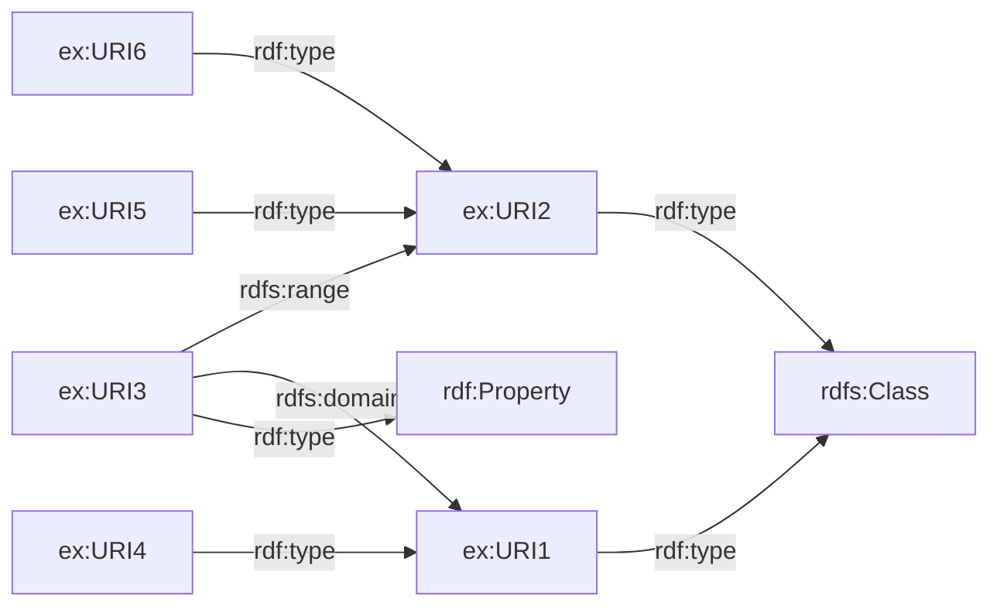
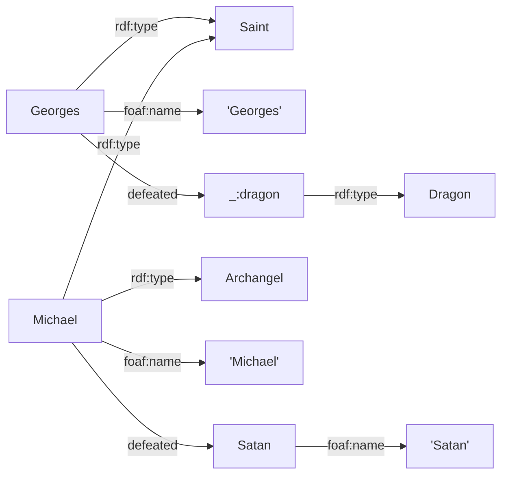
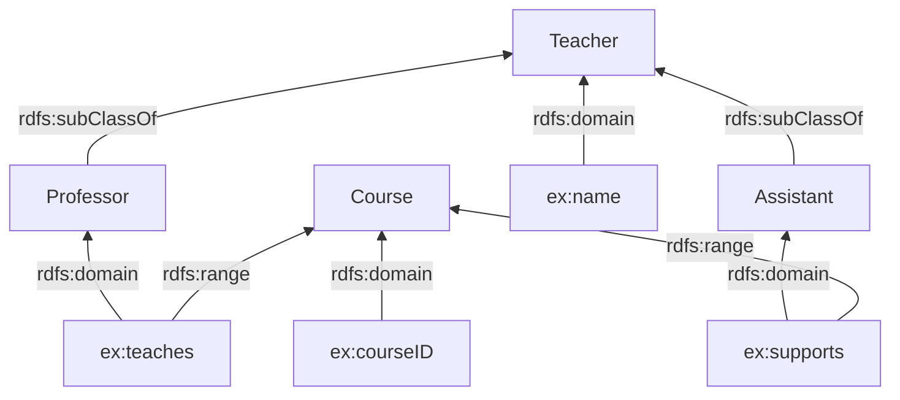
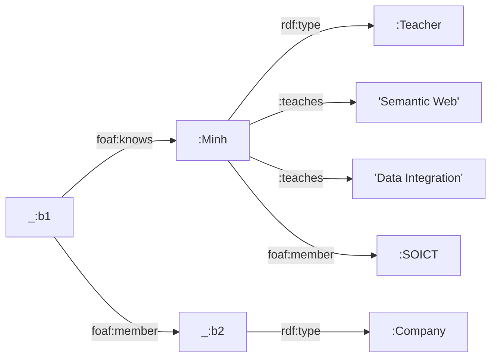

# Phần 1: RDF / RDFS — Lời giải (Bài tập 1–7)

---

## Bài tập 1 — Biểu diễn các câu ngôn ngữ tự nhiên thành bộ ba RDF

> Biểu diễn mỗi câu sử dụng ít nhất 3 bộ ba (triples).

```turtle
@prefix rdf:  <http://www.w3.org/1999/02/22-rdf-syntax-ns#> .
@prefix rdfs: <http://www.w3.org/2000/01/rdf-schema#> .
@prefix ex:   <http://example.org/> .
@prefix foaf: <http://xmlns.com/foaf/0.1/> .
@prefix schema: <http://schema.org/> .

### Câu 1: Viện CNTT&TT (SOICT) toạ lạc tại số 1, Đại Cồ Việt, Hai Bà Trưng, Hà Nội
ex:SOICT  rdf:type          schema:Organization ;
          schema:name        "SOICT" ;
          schema:address     "No. 1, Dai Co Viet, Hai Ba Trung, Hanoi" .

### Câu 2: Website https://soict.hust.edu.vn/ là trang chủ của SOICT
<https://soict.hust.edu.vn/>
          rdf:type           foaf:Document ;
          rdfs:label         "SOICT Homepage" ;
          foaf:homepage      ex:SOICT .
# (Hoặc cách khác: ex:SOICT foaf:homepage <https://soict.hust.edu.vn/> .)

### Câu 3: URI1 là khoá học về Semantic Web, được giảng dạy bởi Thầy Hùng tại phòng B1-404
ex:URI1   rdf:type           ex:Course ;
          ex:courseName      "Semantic Web" ;
          ex:taughtBy        ex:Hung ;
          ex:room            "B1-404" .

ex:Hung   rdf:type           ex:Lecturer ;
          foaf:name          "Hung" .
```

---

## Bài tập 2 — Dublin Core (Tài liệu, Tác giả, Reification/Cụ thể hoá)

```turtle
@prefix rdf:  <http://www.w3.org/1999/02/22-rdf-syntax-ns#> .
@prefix rdfs: <http://www.w3.org/2000/01/rdf-schema#> .
@prefix dc:   <http://purl.org/dc/elements/1.1/> .
@prefix ex:   <http://example.org/> .

### Tài liệu 1 được tạo bởi Minh
ex:doc1   dc:creator   "Minh" .

### Tài liệu 2 và Tài liệu 3 được tạo bởi cùng một tác giả (không xác định) → blank node
_:author  dc:creator   _:author .   # (định nghĩa blank node)
ex:doc2   dc:creator   _:author .
ex:doc3   dc:creator   _:author .

### Tài liệu 3 phát biểu rằng Tài liệu 1 được xuất bản bởi W3C → Reification
ex:statement1  rdf:type       rdf:Statement ;
               rdf:subject    ex:doc1 ;
               rdf:predicate  dc:publisher ;
               rdf:object     "W3C" .

ex:doc3        ex:states      ex:statement1 .
```

> [!NOTE]
> Câu thứ ba yêu cầu dùng **RDF Reification (Cụ thể hoá)** vì Tài liệu 3 *nói về* một bộ ba khác (Tài liệu 1 được xuất bản bởi W3C). Chúng ta tạo một tài nguyên `rdf:Statement` để biểu diễn bộ ba được cụ thể hoá đó.

---

## Bài tập 3 — Lớp, Thuộc tính, Miền (Domain) & Miền giá trị (Range)

```turtle
@prefix rdf:  <http://www.w3.org/1999/02/22-rdf-syntax-ns#> .
@prefix rdfs: <http://www.w3.org/2000/01/rdf-schema#> .
@prefix ex:   <http://example.org/> .

### URI1 và URI2 là các lớp
ex:URI1   rdf:type   rdfs:Class .
ex:URI2   rdf:type   rdfs:Class .

### URI3 là một thuộc tính
ex:URI3   rdf:type   rdf:Property .

### URI4 là một thể hiện của URI1
ex:URI4   rdf:type   ex:URI1 .

### URI5 và URI6 là các thể hiện của URI2
ex:URI5   rdf:type   ex:URI2 .
ex:URI6   rdf:type   ex:URI2 .

### URI3 có domain là URI1 và range là URI2
ex:URI3   rdfs:domain   ex:URI1 ;
          rdfs:range    ex:URI2 .
```



---

## Bài tập 4 — Từ đồ thị sang Turtle (Saint, Archangel, Georges, Michael)

**Đồ thị gốc:**


**Biểu diễn Turtle:**

```turtle
@prefix rdf:  <http://www.w3.org/1999/02/22-rdf-syntax-ns#> .
@prefix foaf: <http://xmlns.com/foaf/0.1/> .
@prefix ex:   <http://example.org/> .

### Georges
ex:Georges  rdf:type     ex:Saint ;
            foaf:name    "Georges" ;
            ex:defeated  [ rdf:type ex:Dragon ] .

### Michael
ex:Michael  rdf:type     ex:Saint ;
            rdf:type     ex:Archangel ;
            foaf:name    "Michael" ;
            ex:defeated  ex:Satan .

### Satan
ex:Satan    foaf:name    "Satan" .
```

> [!TIP]
> - Georges đã đánh bại **một con rồng** (đại diện bằng một nút vô danh / blank node có kiểu là Dragon).
> - Michael vừa là một `Saint` (Thánh) vừa là một `Archangel` (Thiên lãnh thần).
> - Satan là một tài nguyên có định danh với duy nhất một thuộc tính `foaf:name`.

**Sơ đồ Mermaid:**



---

## Bài tập 5 — Professor, Assistant, Teacher, Course

> Tạo một đồ thị và biểu diễn dưới dạng các bộ ba.

```turtle
@prefix rdf:  <http://www.w3.org/1999/02/22-rdf-syntax-ns#> .
@prefix rdfs: <http://www.w3.org/2000/01/rdf-schema#> .
@prefix ex:   <http://example.org/> .

### Các lớp (Classes)
ex:Teacher     rdf:type   rdfs:Class .
ex:Professor   rdf:type   rdfs:Class ;
               rdfs:subClassOf  ex:Teacher .
ex:Assistant   rdf:type   rdfs:Class ;
               rdfs:subClassOf  ex:Teacher .
ex:Course      rdf:type   rdfs:Class .

### Các thuộc tính (Properties)
ex:name        rdf:type      rdf:Property ;
               rdfs:domain   ex:Teacher ;
               rdfs:range    rdfs:Literal .

ex:courseID     rdf:type      rdf:Property ;
               rdfs:domain   ex:Course ;
               rdfs:range    rdfs:Literal .

ex:teaches     rdf:type      rdf:Property ;
               rdfs:domain   ex:Professor ;
               rdfs:range    ex:Course .

ex:supports    rdf:type      rdf:Property ;
               rdfs:domain   ex:Assistant ;
               rdfs:range    ex:Course .
```



---

## Bài tập 6 — Xây dựng đồ thị từ các bộ ba cho sẵn

**Dữ liệu Turtle cho sẵn:**
```turtle
PREFIX :     <http://example.org/>
PREFIX rdf:  <http://www.w3.org/1999/02/22-rdf-syntax-ns#>
PREFIX foaf: <http://xmlns.com/foaf/0.1/>

:Minh a :Teacher ;
      :teaches "Semantic Web" , "Data Integration" ;
      foaf:member :SOICT .

[] foaf:knows :Minh ; foaf:member [ a :Company ] .
```

**Phân tích:**
- `:Minh` là một `:Teacher`, giảng dạy hai môn học (giá trị chuỗi/literal), và là `foaf:member` của `:SOICT`.
- Một **người vô danh** (`[]` = blank node `_:b1`) biết `:Minh` và là thành viên của một **công ty vô danh** (`[]` = blank node `_:b2`, có kiểu là `:Company`).



---

## Bài tập 7 — Mô tả thư viện

> Mô tả một thư viện với thông tin về sách, tác giả, nhà xuất bản, năm, v.v.

```turtle
@prefix rdf:   <http://www.w3.org/1999/02/22-rdf-syntax-ns#> .
@prefix rdfs:  <http://www.w3.org/2000/01/rdf-schema#> .
@prefix dc:    <http://purl.org/dc/elements/1.1/> .
@prefix foaf:  <http://xmlns.com/foaf/0.1/> .
@prefix xsd:   <http://www.w3.org/2001/XMLSchema#> .
@prefix ex:    <http://example.org/library/> .

### Các lớp (Classes)
ex:Book        rdf:type   rdfs:Class .
ex:Author      rdf:type   rdfs:Class .
ex:Publisher    rdf:type   rdfs:Class .
ex:Library     rdf:type   rdfs:Class .

### Các thuộc tính (Properties)
ex:hasBook     rdf:type      rdf:Property ;
               rdfs:domain   ex:Library ;
               rdfs:range    ex:Book .

ex:publishedBy rdf:type      rdf:Property ;
               rdfs:domain   ex:Book ;
               rdfs:range    ex:Publisher .

ex:year        rdf:type      rdf:Property ;
               rdfs:domain   ex:Book ;
               rdfs:range    xsd:integer .

### Dữ liệu thể hiện (Instance data)
ex:CentralLibrary  rdf:type     ex:Library ;
                   rdfs:label   "Central Library" ;
                   ex:hasBook   ex:Book1 , ex:Book2 .

ex:Book1   rdf:type        ex:Book ;
           dc:title        "Semantic Web Primer" ;
           dc:creator      ex:Author1 ;
           ex:publishedBy  ex:Springer ;
           ex:year         2004 .

ex:Book2   rdf:type        ex:Book ;
           dc:title        "Learning SPARQL" ;
           dc:creator      ex:Author2 ;
           ex:publishedBy  ex:OReilly ;
           ex:year         2013 .

ex:Author1    rdf:type   ex:Author ;
              foaf:name  "Grigoris Antoniou" .

ex:Author2    rdf:type   ex:Author ;
              foaf:name  "Bob DuCharme" .

ex:Springer   rdf:type   ex:Publisher ;
              foaf:name  "Springer" .

ex:OReilly    rdf:type   ex:Publisher ;
              foaf:name  "O'Reilly Media" .
```
