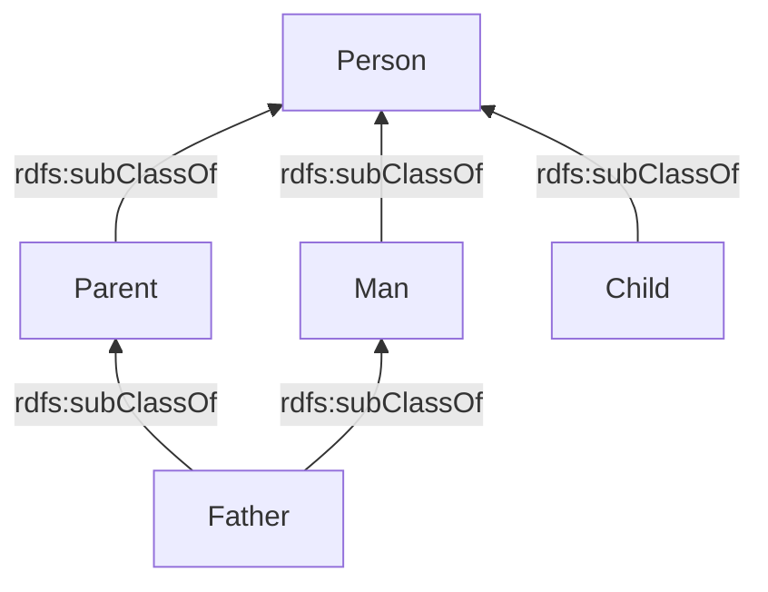
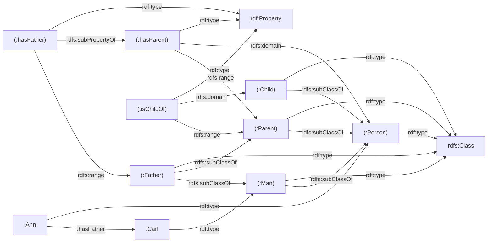

# Phần 2: RDFS — Lời giải (Bài tập 1–2)

---

## Bài tập 1 — Mô tả Ontology

**Sơ đồ ontology gốc:**


### Mô tả bằng ngôn ngữ tự nhiên

Ontology này mô hình hóa miền ẩm thực/dị ứng với hai tầng:

**Tri thức thuật ngữ (Terminological Knowledge - Mức lược đồ RDFS):**
- `ex:AllergicToNuts` là một lớp; `ex:Pitiable` là **lớp cha** của nó (`rdfs:subClassOf`).
- `ex:Thai` là một lớp đại diện cho ẩm thực Thái Lan.
- `ex:Nutty` là một lớp đại diện cho các thực phẩm chứa hạt.
- `ex:hasIngredient` là một thuộc tính — nó có kiểu là `rdfs:ContainerMembershipProperty`.
- `ex:thaiDishBasedOn` là một **thuộc tính con** của `ex:hasIngredient` (`rdfs:subPropertyOf`).
- `ex:thaiDishBasedOn` có **domain** (miền xác định) là `ex:Thai` và **range** (miền giá trị) là `ex:Nutty`.

**Tri thức khẳng định (Assertional Knowledge - Mức thể hiện RDF):**
- `ex:sebastian` là một thể hiện (instance) của lớp `ex:AllergicToNuts`.
- `ex:sebastian` `ex:eats` `ex:vegetableThaiCurry`.
- `ex:vegetableThaiCurry` `ex:thaiDishBasedOn` `ex:coconutMilk`.

### Biểu diễn bằng Turtle

```turtle
@prefix rdf:  <http://www.w3.org/1999/02/22-rdf-syntax-ns#> .
@prefix rdfs: <http://www.w3.org/2000/01/rdf-schema#> .
@prefix ex:   <http://example.org/> .

### ── Tri thức thuật ngữ (RDFS) ──

ex:Pitiable        rdf:type   rdfs:Class .
ex:AllergicToNuts   rdf:type   rdfs:Class ;
                    rdfs:subClassOf  ex:Pitiable .
ex:Thai            rdf:type   rdfs:Class .
ex:Nutty           rdf:type   rdfs:Class .

ex:hasIngredient   rdf:type   rdfs:ContainerMembershipProperty .

ex:thaiDishBasedOn rdf:type   rdf:Property ;
                   rdfs:subPropertyOf  ex:hasIngredient ;
                   rdfs:domain   ex:Thai ;
                   rdfs:range    ex:Nutty .

### ── Tri thức khẳng định (RDF) ──

ex:sebastian          rdf:type   ex:AllergicToNuts .
ex:sebastian          ex:eats    ex:vegetableThaiCurry .
ex:vegetableThaiCurry ex:thaiDishBasedOn  ex:coconutMilk .
```

> [!NOTE]
> **Các suy luận (inferences) từ lập luận RDFS:**
> - `ex:sebastian` cũng là một thể hiện của lớp `ex:Pitiable` (thông qua tính bắc cầu của `subClassOf`).
> - `ex:vegetableThaiCurry` được suy ra là có kiểu `ex:Thai` (thông qua quy tắc `rdfs:domain` của `thaiDishBasedOn`).
> - `ex:coconutMilk` được suy ra là có kiểu `ex:Nutty` (thông qua quy tắc `rdfs:range` của `thaiDishBasedOn`).
> - Bộ ba `ex:vegetableThaiCurry ex:hasIngredient ex:coconutMilk` được suy luận ra (thông qua `subPropertyOf`).

---

## Bài tập 2 — Phân tích Đúng/Sai

### Các định nghĩa RDF đã cho (nhắc lại)

```turtle
@prefix rdf:  <http://www.w3.org/1999/02/22-rdf-syntax-ns#> .
@prefix rdfs: <http://www.w3.org/2000/01/rdf-schema#> .
@prefix :     <http://example.com/terms#> .

:Person     a rdfs:Class .
:Man        a rdfs:Class ; rdfs:subClassOf :Person .
:Parent     a rdfs:Class ; rdfs:subClassOf :Person .
:Father     a rdfs:Class ; rdfs:subClassOf :Parent ; rdfs:subClassOf :Man .
:Child      a rdfs:Class ; rdfs:subClassOf :Person .

:hasParent  a rdf:Property ; rdfs:domain :Person ; rdfs:range :Parent .
:hasFather  a rdf:Property ; rdfs:subPropertyOf :hasParent ; rdfs:range :Father .
:isChildOf  a rdf:Property ; rdfs:domain :Child ; rdfs:range :Parent .

:Ann   a :Person ; :hasFather :Carl .
:Carl  a :Man .
```

### Sơ đồ phân cấp lớp



### Phần A — Đồ thị



### Phần B — Các phát biểu Đúng/Sai

| # | Phát biểu | Trả lời | Giải thích |
|---|-----------|---------|------------|
| 1 | `:Father rdfs:subClassOf :Person` | **ĐÚNG** | `:Father` ⊆ `:Parent` ⊆ `:Person` dựa trên **tính bắc cầu của `rdfs:subClassOf`** (quy tắc rdfs11). |
| 2 | `:Man rdfs:subClassOf :Person` | **ĐÚNG** | Đã được phát biểu rõ ràng trong dữ liệu cho sẵn. |
| 3 | `:Carl a :Person` | **ĐÚNG** | `:Carl a :Man`, và `:Man rdfs:subClassOf :Person` → theo quy tắc **rdfs9** (thể hiện + lớp con → thể hiện của lớp cha), ta suy ra `:Carl a :Person`. |
| 4 | `:Carl a :Parent` | **ĐÚNG** | `:Ann :hasFather :Carl`. Mà `:hasFather rdfs:subPropertyOf :hasParent` → theo **rdfs7**, `:Ann :hasParent :Carl`. Lại có `:hasParent rdfs:range :Parent` → theo **rdfs3** (quy tắc range), suy ra `:Carl a :Parent`. |
| 5 | `:Carl :hasChild :Ann` | **SAI** | Không có thuộc tính `:hasChild` nào được định nghĩa trong ontology, và cũng không có khai báo `owl:inverseOf` nào (chỉ với RDFS thì không thể suy diễn thuộc tính ngược/inverse). Bộ ba này không thể được suy luận ra (entailed). |
| 6 | `:Carl a :Man` | **ĐÚNG** | Đã được khẳng định rõ trong dữ liệu: `:Carl a :Man`. |
| 7 | `:Carl a :Father` | **ĐÚNG** | Từ câu 4, `:Carl a :Parent`. Từ dữ liệu gốc, `:Carl a :Man`. Thêm vào đó, ta có `:Ann :hasFather :Carl` và `:hasFather rdfs:range :Father` → theo **rdfs3**, suy ra `:Carl a :Father`. |
| 8 | `:Child rdf:type rdfs:Resource` | **ĐÚNG** | Trong RDFS, **mọi thứ đều là một `rdfs:Resource`**. Mọi tài nguyên được mô tả đều là một thể hiện của lớp `rdfs:Resource` (đây là một bộ ba tiên đề/axiomatic triple). |
| 9 | `:Ann a :Child` | **SAI** | Không có khẳng định hay quy tắc RDFS nào làm cho `:Ann` trở thành một thể hiện của `:Child`. Cô ấy là `:Person` (thông qua suy diễn từ domain của `hasFather`), nhưng `:Child` không giống với `:Person` — nó chỉ là một lớp con của `:Person`. Là một `:Person` KHÔNG CÓ NGHĨA bạn là một `:Child`. |
| 10 | `:Ann :isChildOf :Carl` | **SAI** | `:isChildOf` là một thuộc tính hoàn toàn độc lập. Nó KHÔNG được khai báo là có liên quan tới `:hasParent` hoặc `:hasFather` (không có `rdfs:subPropertyOf` hay tính chất ngược). RDFS không thể tự suy luận ra mối quan hệ này. |
| 11 | `:Ann :hasParent :Carl` | **ĐÚNG** | `:Ann :hasFather :Carl` + `:hasFather rdfs:subPropertyOf :hasParent` → theo **rdfs7**, suy ra `:Ann :hasParent :Carl`. |
| 12 | `:Ann :hasParent _:x` | **ĐÚNG** | Vì `:Ann :hasParent :Carl` được suy ra (từ câu 11), nên hiển nhiên tồn tại một tài nguyên (cụ thể là `:Carl`) sao cho `:Ann :hasParent` với tài nguyên đó. Trong ngữ nghĩa RDF, các phát biểu tồn tại (existential statements) với các nút vô danh (blank nodes) sẽ đúng (được suy diễn ra) khi có một thể hiện cụ thể tồn tại thoả mãn điều đó. |
| 13 | `:Ann :hasParent [ rdf:type :Person ]` | **ĐÚNG** | Từ câu 11: `:Ann :hasParent :Carl`. Từ câu 3: `:Carl a :Person`. Vậy `:Ann :hasParent` với một ai đó có kiểu là `:Person`. Mẫu blank node `[ rdf:type :Person ]` hoàn toàn được thỏa mãn bởi `:Carl`. |
| 14 | `:hasFather rdfs:domain :Person` | **ĐÚNG** | `:hasFather rdfs:subPropertyOf :hasParent` và `:hasParent rdfs:domain :Person`. Theo luật suy diễn **rdfs-entailment** (kết hợp rdfs7 và rdfs2): nếu `p rdfs:subPropertyOf q` và `q rdfs:domain C`, thì `p rdfs:domain C`. Do đó `:hasFather rdfs:domain :Person`. |
| 15 | `rdfs:range rdf:type rdfs:Resource` | **ĐÚNG** | Giống như câu 8 — trong RDFS, mọi tài nguyên (bao gồm cả chính thuộc tính `rdfs:range`) đều là một `rdfs:Resource`. Đây là tiên đề. |
| 16 | `:hasFather rdfs:range :Father` | **ĐÚNG** | Đã được phát biểu rõ trong dữ liệu RDF cho sẵn. |
| 17 | `:hasFather rdfs:domain [ rdfs:subClassOf :Person ]` | **ĐÚNG** | Từ câu 14, `:hasFather rdfs:domain :Person`. Và `:Person rdfs:subClassOf :Person` luôn luôn đúng (do tính phản xạ của `rdfs:subClassOf` — một tiên đề trong RDFS, quy tắc rdfs10). Vì vậy mẫu blank node `[ rdfs:subClassOf :Person ]` có thể được khớp (match) với `:Person`. |
| 18 | `:Father rdfs:subClassOf [ rdfs:subClassOf :Person ]` | **ĐÚNG** | Từ câu 1: `:Father rdfs:subClassOf :Person`. Theo tính phản xạ (rdfs10): `:Person rdfs:subClassOf :Person`. Vậy blank node `[ rdfs:subClassOf :Person ]` có thể được khớp với `:Person`, làm cho phát biểu `:Father rdfs:subClassOf :Person` được thỏa mãn. |

> [!IMPORTANT]
> **Các quy tắc suy diễn RDFS chính được sử dụng:**
> - **rdfs2** (domain): `?p rdfs:domain ?C` ∧ `?x ?p ?y` → `?x rdf:type ?C`
> - **rdfs3** (range): `?p rdfs:range ?C` ∧ `?x ?p ?y` → `?y rdf:type ?C`
> - **rdfs7** (subPropertyOf): `?p rdfs:subPropertyOf ?q` ∧ `?x ?p ?y` → `?x ?q ?y`
> - **rdfs9** (subClassOf + type): `?C rdfs:subClassOf ?D` ∧ `?x rdf:type ?C` → `?x rdf:type ?D`
> - **rdfs10** (reflexivity - tính phản xạ): `?C rdfs:subClassOf ?C`
> - **rdfs11** (transitivity - tính bắc cầu): `?A rdfs:subClassOf ?B` ∧ `?B rdfs:subClassOf ?C` → `?A rdfs:subClassOf ?C`
