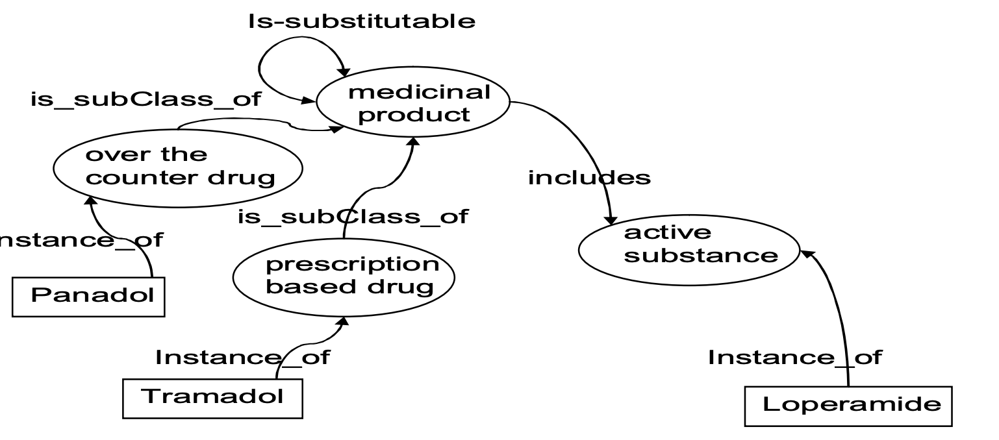
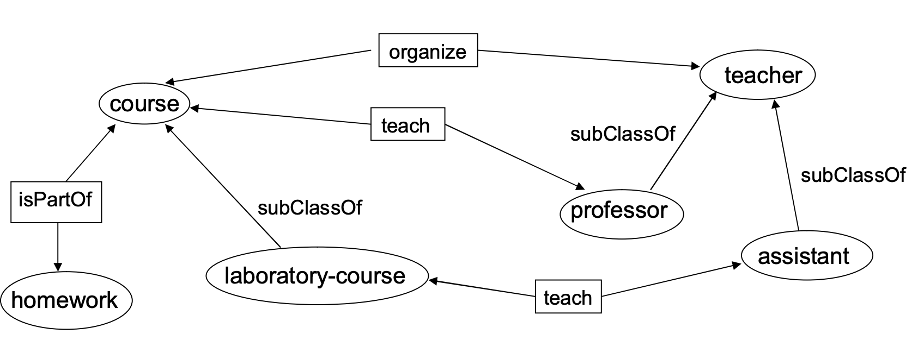
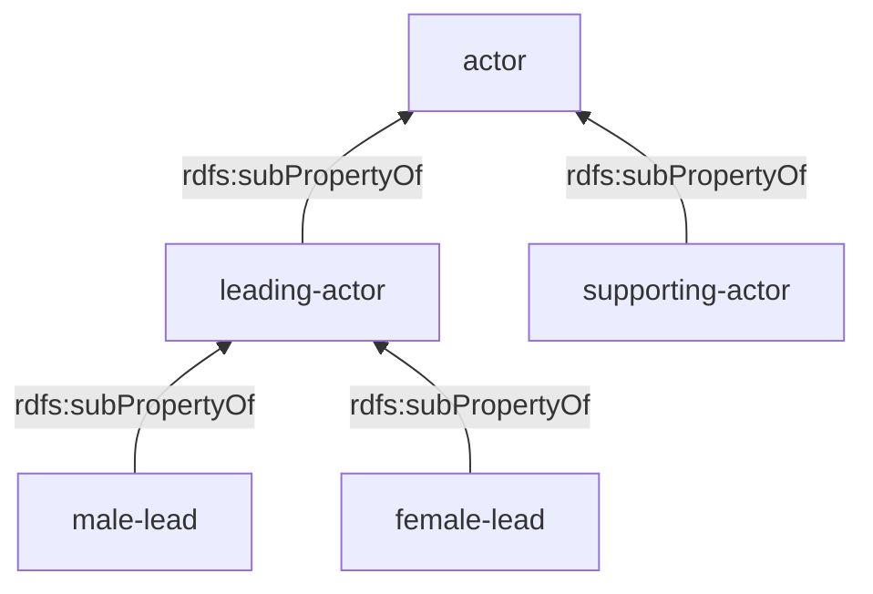

# Phần 3: OWL — Lời giải (Bài tập 1–4)

---

## Bài tập 1 — Ontology Pizza (Manchester)

### Câu 1. Mở pizza.owl, kiểm tra các lớp và thuộc tính.

Ontology Pizza định nghĩa một hệ thống phân cấp bắt nguồn từ `owl:Thing` với các lớp chính:
- **Pizza** — một loại thức ăn cơ bản với các lớp phủ (topping)
- **PizzaBase** (Đế Pizza) — Đế mỏng giòn (ThinAndCrispy) hoặc Đế dày (DeepPan)
- **PizzaTopping** (Lớp phủ) — Phủ phô mai (CheeseTopping), Phủ thịt (MeatTopping), Phủ rau củ (VegetableTopping), Phủ cá (FishTopping), v.v.
- **NamedPizza** — lớp con của Pizza, với các thể hiện có định danh cụ thể (Margherita, American, v.v.)
- **Country** (Quốc gia) — các thể hiện như Ý (Italy), Anh (England), Pháp (France), Đức (Germany), Mỹ (America)

### Câu 2. Margherita và VegetarianPizza

**Margherita** được định nghĩa là:
```
Pizza
  and (hasTopping some MozzarellaTopping)
  and (hasTopping some TomatoTopping)
  and (hasTopping only (MozzarellaTopping or TomatoTopping))
```

**VegetarianPizza** (Pizza chay) được định nghĩa là:
```
Pizza
  and (hasTopping only
       (CheeseTopping or FruitTopping or HerbSpiceTopping
        or NutTopping or SauceTopping or VegetableTopping))
```

**Margherita có phải là một VegetarianPizza không?**  
**Có** — sau khi được phân loại bởi bộ suy diễn (reasoner). Margherita chỉ có lớp phủ là Mozzarella (`MozzarellaTopping`) và Cà chua (`TomatoTopping`). Mà `MozzarellaTopping` ⊆ `CheeseTopping` (Phủ phô mai) và `TomatoTopping` ⊆ `VegetableTopping` (Phủ rau củ), cả hai lớp phủ này đều nằm trong tập hợp cho phép của `VegetarianPizza`. Tiên đề đóng (closure axiom) `hasTopping only (...)` trên `Margherita` đảm bảo không có bất kỳ loại topping nào khác tồn tại. Do đó nó thỏa mãn điều kiện của `VegetarianPizza`.

### Câu 3. hasIngredient

| Đặc điểm | Giá trị |
|--------|-------|
| **Miền (Domain)** | `Food` |
| **Miền giá trị (Range)** | `Food` |
| **Các thuộc tính con (Subproperties)** | `hasBase`, `hasTopping` |
| **Thuộc tính ngược (Inverse)** | `isIngredientOf` |
| **Đặc tính (Characteristics)** | **Bắc cầu (Transitive)** |

### Câu 4. Phân loại — các lớp con của owl:Nothing

**Sự khác biệt giữa hệ thống phân cấp lớp được khẳng định (Asserted) và được suy diễn (Inferred):**
- Hệ thống phân cấp **được khẳng định (asserted hierarchy)** chỉ chứa những cấu trúc được tác giả ontology phát biểu một cách rõ ràng.
- Hệ thống phân cấp **được suy diễn (inferred hierarchy)** được tính toán bởi một bộ suy diễn DL (VD: Pellet, HermiT) bằng cách sử dụng phép kéo theo logic (logical entailment) từ tất cả các tiên đề (bao gồm các ràng buộc, tính rời rạc, domain/range).

**Ý nghĩa của việc là một lớp con của `owl:Nothing`?**  
`owl:Nothing` là một **lớp rỗng** — nó không chứa bất kỳ thể hiện nào. Một lớp là lớp con của `owl:Nothing` là lớp **không thể thỏa mãn (unsatisfiable)** (không nhất quán về mặt logic). Điều này có nghĩa là các ràng buộc của lớp đó đang mâu thuẫn với nhau và không một cá thể nào có thể thuộc về lớp đó.

**Tại sao có hai lớp xuất hiện là lớp con của `owl:Nothing`?**  
Thường là `IceCreamCourse` và `CheeseyVegetableTopping` (tùy thuộc vào phiên bản ontology). Các lớp này chứa những ràng buộc mâu thuẫn nhau. Ví dụ:
- Một lớp có thể yêu cầu `hasTopping some X` VÀ `hasTopping only Y`, trong đó X ⊄ Y.
- Hoặc một lớp kế thừa các ràng buộc từ các lớp cha rời rạc nhau (disjoint), dẫn đến việc không thể đồng thời thỏa mãn tất cả.

**Các lớp cha được suy diễn của Margherita:**
Sau khi phân loại bằng reasoner, Margherita được suy diễn là lớp con của: `VegetarianPizza`, `CheeseyPizza`, `Pizza`, `Food`, `DomainConcept`, `owl:Thing`.

### Câu 5. Grandiosa (một NamedPizza mới)

Grandiosa được định nghĩa là:
```
NamedPizza
  and (hasTopping some HamTopping)
  and (hasTopping some TomatoTopping)
  and (hasTopping some CheeseTopping)
```

**Các lớp cha được suy diễn sau khi phân loại:**
- `MeatyPizza` — bởi vì nó có chứa `HamTopping` (mà `HamTopping` ⊆ `MeatTopping`)
- `CheeseyPizza` — bởi vì nó có chứa `CheeseTopping`
- `Pizza`, `Food`, `DomainConcept`, `owl:Thing`
- Nó **KHÔNG PHẢI** là một `VegetarianPizza` (vì nó có thịt). LƯU Ý: nếu không có tiên đề đóng (closure axiom) như `hasTopping only (...)`, bộ suy diễn có thể không phân loại nó chính xác hoàn toàn. Dù sao nó vẫn không phải pizza chay bởi vì `HamTopping` ⊆ `MeatTopping`, và `MeatTopping` là một tập rời rạc (disjoint) với các loại topping được phép dùng trong `VegetarianPizza`.

### Câu 6. Grandiosa đến từ Na Uy

```turtle
:Grandiosa :hasCountryOfOrigin :Norway .
:Norway    owl:differentFrom :Italy, :America, :England,
                             :France, :Germany .
```

Sau khi suy diễn: Grandiosa giờ đây đã có quốc gia xuất xứ. Nếu một lớp (như `AmericanPizza`) có yêu cầu thuộc tính `hasCountryOfOrigin value America`, Grandiosa sẽ không thể là American Pizza bởi vì `:Norway owl:differentFrom :America` (Na Uy khác Mỹ).

---

## Bài tập 2 — Ontology cho Sản phẩm Y tế

**Sơ đồ tham khảo:**



```turtle
@prefix rdf:  <http://www.w3.org/1999/02/22-rdf-syntax-ns#> .
@prefix rdfs: <http://www.w3.org/2000/01/rdf-schema#> .
@prefix owl:  <http://www.w3.org/2002/07/owl#> .
@prefix xsd:  <http://www.w3.org/2001/XMLSchema#> .
@prefix :     <http://example.org/pharma#> .

### ── Khai báo Ontology ──
<http://example.org/pharma> rdf:type owl:Ontology .

### ── Các lớp (Classes) ──
:MedicinalProduct  rdf:type  owl:Class .

:OverTheCounterDrug  rdf:type  owl:Class ;
    rdfs:subClassOf  :MedicinalProduct .

:PrescriptionBasedDrug  rdf:type  owl:Class ;
    rdfs:subClassOf  :MedicinalProduct .

:ActiveSubstance  rdf:type  owl:Class .

### Tính rời rạc (Disjointness): Thuốc không kê đơn (OTC) và thuốc kê đơn là rời rạc
:OverTheCounterDrug  owl:disjointWith  :PrescriptionBasedDrug .

### Hợp (Union): Sản phẩm y tế là thuốc không kê đơn hoặc thuốc kê đơn
:MedicinalProduct  owl:equivalentClass  [
    rdf:type  owl:Class ;
    owl:unionOf ( :OverTheCounterDrug :PrescriptionBasedDrug )
] .

### ── Các thuộc tính (Properties) ──

# Mỗi loại thuốc bao gồm một hoạt chất (active substance)
:includes  rdf:type  owl:ObjectProperty ;
    rdfs:domain  :MedicinalProduct ;
    rdfs:range   :ActiveSubstance .

# Ràng buộc tồn tại (existential restriction): Mỗi loại thuốc chứa một hoạt chất
:MedicinalProduct  rdfs:subClassOf  [
    rdf:type  owl:Restriction ;
    owl:onProperty  :includes ;
    owl:someValuesFrom  :ActiveSubstance
] .

# Mỗi loại thuốc có thể được thay thế bởi không hoặc nhiều loại thuốc khác
:isSubstitutable  rdf:type  owl:ObjectProperty ;
    rdfs:domain  :MedicinalProduct ;
    rdfs:range   :MedicinalProduct .

### ── Các thể hiện (Instances) ──
:Panadol     rdf:type  :OverTheCounterDrug .
:Tramadol    rdf:type  :PrescriptionBasedDrug .
:Loperamide  rdf:type  :ActiveSubstance .
```

**Tóm tắt bằng Manchester Syntax:**
```
Class: MedicinalProduct
    EquivalentTo: OverTheCounterDrug or PrescriptionBasedDrug
    SubClassOf: includes some ActiveSubstance

Class: OverTheCounterDrug
    SubClassOf: MedicinalProduct
    DisjointWith: PrescriptionBasedDrug

Class: PrescriptionBasedDrug
    SubClassOf: MedicinalProduct

ObjectProperty: includes
    Domain: MedicinalProduct
    Range: ActiveSubstance

ObjectProperty: isSubstitutable
    Domain: MedicinalProduct
    Range: MedicinalProduct

Individual: Panadol    Types: OverTheCounterDrug
Individual: Tramadol   Types: PrescriptionBasedDrug
Individual: Loperamide Types: ActiveSubstance
```

---

## Bài tập 3 — Ontology cho Môn học & Giảng viên

**Sơ đồ tham khảo:**



```turtle
@prefix rdf:  <http://www.w3.org/1999/02/22-rdf-syntax-ns#> .
@prefix rdfs: <http://www.w3.org/2000/01/rdf-schema#> .
@prefix owl:  <http://www.w3.org/2002/07/owl#> .
@prefix :     <http://example.org/education#> .

### ── Ontology ──
<http://example.org/education> rdf:type owl:Ontology .

### ── Các lớp (Classes) ──
:Course  rdf:type  owl:Class .

:LaboratoryCourse  rdf:type  owl:Class ;
    rdfs:subClassOf  :Course .

:Teacher  rdf:type  owl:Class .

:Professor  rdf:type  owl:Class ;
    rdfs:subClassOf  :Teacher .

:Assistant  rdf:type  owl:Class ;
    rdfs:subClassOf  :Teacher .

:Homework  rdf:type  owl:Class .

### Tính rời rạc (Disjointness)
:Professor  owl:disjointWith  :Assistant .

### Hợp (Union): Giảng viên (Teacher) = Giáo sư (Professor) hoặc Trợ giảng (Assistant)
:Teacher  owl:equivalentClass  [
    rdf:type  owl:Class ;
    owl:unionOf ( :Professor :Assistant )
] .

### ── Các thuộc tính (Properties) ──

# Các khóa học được tổ chức bởi giảng viên
:organize  rdf:type  owl:ObjectProperty ;
    rdfs:domain  :Teacher ;
    rdfs:range   :Course .

# Giáo sư giảng dạy các khóa học (bất kỳ khóa học nào)
:teach  rdf:type  owl:ObjectProperty ;
    rdfs:domain  :Professor ;
    rdfs:range   :Course .

# Trợ giảng chỉ giảng dạy các khóa học thực hành / phòng thí nghiệm (giới hạn range cho trợ giảng)
:Assistant  rdfs:subClassOf  [
    rdf:type  owl:Restriction ;
    owl:onProperty  :teach ;
    owl:allValuesFrom  :LaboratoryCourse
] .

# Bài tập về nhà là một phần của khóa học
:isPartOf  rdf:type  owl:ObjectProperty ;
    rdfs:domain  :Homework ;
    rdfs:range   :Course .
```

**Tóm tắt bằng Manchester Syntax:**
```
Class: Course
Class: LaboratoryCourse  SubClassOf: Course
Class: Teacher  EquivalentTo: Professor or Assistant
Class: Professor  SubClassOf: Teacher, DisjointWith: Assistant
Class: Assistant  SubClassOf: Teacher, teach only LaboratoryCourse
Class: Homework

ObjectProperty: organize  Domain: Teacher  Range: Course
ObjectProperty: teach     Domain: Professor  Range: Course
ObjectProperty: isPartOf  Domain: Homework  Range: Course
```

---

## Bài tập 4 — Ontology cho Phim ảnh

```turtle
@prefix rdf:  <http://www.w3.org/1999/02/22-rdf-syntax-ns#> .
@prefix rdfs: <http://www.w3.org/2000/01/rdf-schema#> .
@prefix owl:  <http://www.w3.org/2002/07/owl#> .
@prefix dc:   <http://purl.org/dc/elements/1.1/> .
@prefix foaf: <http://xmlns.com/foaf/0.1/> .
@prefix :     <http://example.org/film#> .
@prefix people: <http://example.org/people/> .
@prefix film:   <http://example.org/films/> .

### ── Ontology ──
<http://example.org/film> rdf:type owl:Ontology .

### ══════════════════════════════════════
###  CÁC LỚP (CLASSES)
### ══════════════════════════════════════

:Person  rdf:type  owl:Class .
:Man     rdf:type  owl:Class ; rdfs:subClassOf :Person .
:Woman   rdf:type  owl:Class ; rdfs:subClassOf :Person .

### Person = Man ⊔ Woman (tiên đề phủ kín / covering axiom)
:Person  owl:equivalentClass  [
    rdf:type owl:Class ;
    owl:unionOf ( :Man :Woman )
] .

### Man và Woman là rời rạc nhau (không thể đồng thời là cả hai)
:Man  owl:disjointWith  :Woman .

:Movie              rdf:type  owl:Class .
:LoveMovie          rdf:type  owl:Class ; rdfs:subClassOf :Movie .
:AnimalDocumentary   rdf:type  owl:Class ; rdfs:subClassOf :Movie .
:AnimatedMovie       rdf:type  owl:Class ; rdfs:subClassOf :Movie .

### ══════════════════════════════════════
###  CÁC THUỘC TÍNH (PROPERTIES)
### ══════════════════════════════════════

:director  rdf:type  owl:ObjectProperty ;
    rdfs:domain  :Movie ;
    rdfs:range   :Person .

### actor là thuộc tính cha (super-property)
:actor  rdf:type  owl:ObjectProperty ;
    rdfs:domain  :Movie ;
    rdfs:range   :Person .

### leading-actor ⊆ actor
:leading-actor  rdf:type  owl:ObjectProperty ;
    rdfs:subPropertyOf  :actor ;
    rdfs:domain  :Movie ;
    rdfs:range   :Person .

### supporting-actor ⊆ actor
:supporting-actor  rdf:type  owl:ObjectProperty ;
    rdfs:subPropertyOf  :actor ;
    rdfs:domain  :Movie ;
    rdfs:range   :Person .

### male-lead ⊆ leading-actor, range là Man
:male-lead  rdf:type  owl:ObjectProperty ;
    rdfs:subPropertyOf  :leading-actor ;
    rdfs:domain  :Movie ;
    rdfs:range   :Man .

### female-lead ⊆ leading-actor, range là Woman
:female-lead  rdf:type  owl:ObjectProperty ;
    rdfs:subPropertyOf  :leading-actor ;
    rdfs:domain  :Movie ;
    rdfs:range   :Woman .

dc:title  rdf:type  owl:DatatypeProperty .

### ══════════════════════════════════════
###  ĐỊNH NGHĨA CÁC LỚP PHỨC TẠP
### ══════════════════════════════════════

### LoveMovie (Phim tình cảm): có ít nhất 1 nam chính (male-lead) VÀ ít nhất 1 nữ chính (female-lead)
:LoveMovie  owl:equivalentClass  [
    rdf:type  owl:Class ;
    owl:intersectionOf (
        :Movie
        [   rdf:type  owl:Restriction ;
            owl:onProperty  :male-lead ;
            owl:someValuesFrom  :Man ]
        [   rdf:type  owl:Restriction ;
            owl:onProperty  :female-lead ;
            owl:someValuesFrom  :Woman ]
    )
] .

### Phim không có diễn viên = Phim tài liệu động vật ⊔ Phim hoạt hình
### (Movie ⊓ ¬(∃actor.Person)) ⊆ (AnimalDocumentary ⊔ AnimatedMovie)
[   rdf:type  owl:Class ;
    owl:intersectionOf (
        :Movie
        [   rdf:type  owl:Class ;
            owl:complementOf [
                rdf:type  owl:Restriction ;
                owl:onProperty  :actor ;
                owl:someValuesFrom  owl:Thing
            ]
        ]
    )
] rdfs:subClassOf [
    rdf:type  owl:Class ;
    owl:unionOf ( :AnimalDocumentary :AnimatedMovie )
] .

### ══════════════════════════════════════
###  THỂ HIỆN (đã cho trong bài tập)
### ══════════════════════════════════════

film:avatar  rdf:type  :Movie ;
    dc:title  "Avatar"@en ;
    :director  people:james ;
    :leading-actor  people:sam ;
    :leading-actor  people:zoe ;
    :supporting-actor  people:michelle .

people:james    rdf:type :Man ;  foaf:name "James Cameron" .
people:sam      rdf:type :Man ;  foaf:name "Sam Worthington" .
people:zoe      rdf:type :Woman ; foaf:name "Zoe Saldana" .
people:michelle rdf:type :Woman ; foaf:name "Michelle Rodriguez" .
```

**Tóm tắt bằng Manchester Syntax:**
```
Class: Person  EquivalentTo: Man or Woman
Class: Man     SubClassOf: Person, DisjointWith: Woman
Class: Woman   SubClassOf: Person

Class: Movie
Class: LoveMovie
    EquivalentTo: Movie
        and (male-lead some Man)
        and (female-lead some Woman)
Class: AnimalDocumentary  SubClassOf: Movie
Class: AnimatedMovie      SubClassOf: Movie

ObjectProperty: actor           Domain: Movie  Range: Person
ObjectProperty: leading-actor   SubPropertyOf: actor
ObjectProperty: supporting-actor SubPropertyOf: actor
ObjectProperty: male-lead       SubPropertyOf: leading-actor  Range: Man
ObjectProperty: female-lead     SubPropertyOf: leading-actor  Range: Woman

# Phim không có diễn viên → Phim tài liệu động vật hoặc Phim hoạt hình
Class: (Movie and not (actor some Thing))
    SubClassOf: AnimalDocumentary or AnimatedMovie
```

### Sơ đồ phân cấp thuộc tính


